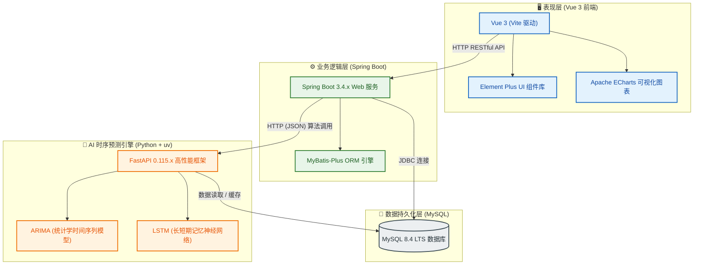

# 🏺 陶瓷产量分析与预测系统 (Ceramic Production Analysis & Prediction System)

> **💡 智能制造与工业互联网的结晶**：本系统是一套专为陶瓷工业打造的、集**生产数据流式管理、多维统计分析、AI 产量精准时序预测、数据可视化大屏**于一体的现代化智能工业互联网平台。

本系统采用先进的**微服务异构解耦架构**，将 Java Spring Boot 的稳健业务逻辑、React 的高响应用户交互，与 Python FastAPI 的高性能时序预测算法（ARIMA / LSTM）完美结合，旨在为陶瓷生产决策提供全方位、高精度的数字化辅助支持。

---

## 🌟 系统核心定位

本系统结构完整、技术新颖、文档详尽，极为适合作为：

* 🎓 **毕业设计 / 课程设计**（Java + Python 异构系统经典案例，亮点突出）
* 📊 **数据分析 / 智能制造研究项目**（时序预测算法在工业场景的落地应用）
* 🏭 **中小型制造企业信息化平台原型**（开箱即用的生产报表与智能看板）

## 🏗️ 系统架构设计

系统采用**前后端分离**及**多语言协同（Java + Python）**的混合微服务架构，既保证了后台管理系统的企业级高可用性，又具备了 AI 算法模型的高效计算和动态服务输出能力。

### 📊 架构拓扑图



---

## ⚙️ 核心功能模块

### 1. 📊 首页数据驾驶舱（Cockpit）
* **即时指标卡片**：今日产量统计、月度趋势分析、成品合格率、能耗走势等核心工业指标一目了然。
* **生产状态监控**：实时追踪窑炉、成型等关键工序的生产状态，动态告警提示。
* **全景图表分析**：基于 ECharts 提供丰富的折线图、柱状图及雷达图，支持多维度下钻与联动展示。

### 2. 🏭 智能生产数据管理（CRUD）
* **全生命周期管理**：提供生产记录的录入、修改、删除、高级条件检索及分页展示。
* **核心工业要素采集**：
  * 📅 生产日期（严格时序）
  * 🏺 产品类型（如：日用瓷、艺术瓷、建筑瓷等）
  * 📦 产量（单位：件/吨）
  * ❌ 缺陷数量（气孔、裂纹、色差等分类统计）
  * 📈 合格率（自动计算：`(产量 - 缺陷数) / 产量 * 100%`）
  * ⚡ 综合能耗（天然气、电力消耗量，支持单件能耗分析）

### 3. 📈 深度数据统计分析（Analytics）
* **趋势与占比**：月度/年度产量演变图，不同品类陶瓷的市场份额占比饼图。
* **质量与能耗监控**：缺陷率趋势与能耗峰谷波动相关性分析，辅助定位异常高耗能、低良率时段。
* **同比与环比分析**：自动计算日、周、月的同环比增长率，量化评估生产效率变化趋势。

### 4. 🔮 AI 智能预测引擎（Forecasting）
* **高精度时间序列预测**：支持日产量、周产量、月产量的中长期趋势预测。
* **多算法混合支撑**：
  * **ARIMA**：自动拟合平稳/非平稳时序数据，极适合具备周期性规律的传统工业排产。
  * **LSTM**：针对复杂非线性及长期依赖的生产曲线进行高保真预测。
  * **线性回归 (LR)**：提供快速基准线对比。
* **误差回测可视化**：图表直观展示预测曲线与真实曲线的重合度，并提供 RMSE、MAPE 等误差指标。

### 5. 📋 企业级数据报表（Reporting）
* **多元格式导出**：一键导出生产记录及分析报表为标准 Excel（`.xlsx`）或 PDF 格式。
* **按需报表生成**：支持自定义日期范围、产品分类组合导出，完美契合日常汇报场景。

---

## 🛠️ 技术栈清单

### 💻 前端技术 (Frontend)
| 框架/类库 | 版本 | 用途与优势 |
| :--- | :--- | :--- |
| **Vue.js** | `3.5.x` | 采用 Composition API，优化了响应式系统与性能，具备更小的体积 |
| **Vite** | `6.x` | 下一代前端超快速构建工具，支持更轻量的热更新与环境管理 |
| **Element Plus** | `2.9.x` | 基于 Vue3.5+ 的企业级优雅 UI 框架，提供精美的表单及列表视图 |
| **ECharts** | `5.6.x` | 百度开源的高性能可视化图表库，实现高度定制化的工业看板与大屏 |
| **Axios** | `Latest` | 强类型、Promise 化的 HTTP 客户端，用于与 Spring Boot 后端交互 |

### ☕ 后端技术 (Backend)
| 框架/类库 | 版本 | 用途与优势 |
| :--- | :--- | :--- |
| **Spring Boot** | `3.4.x` | 主流的企业级 Java 开发框架，内置多项运行时性能改进与安全增强 |
| **MyBatis-Plus**| `3.5.9+`| MyBatis 增强工具，支持 JDK 21+ 优化的底层查询和高效分页 |
| **MySQL** | `8.4 LTS` | 官方长期支持版（LTS）关系型数据库，性能极其稳健，提供优秀的时序索引支持 |
| **Maven** | `3.9.x` | 项目依赖及构建管理工具，规范后端生命周期管理 |
| **RESTful API** | `-` | 遵循标准 REST 规范设计的接口体系，前功隔离，安全清晰 |

### 🐍 AI 预测模块 (Artificial Intelligence)
| 框架/类库 | 版本 | 用途与优势 |
| :--- | :--- | :--- |
| **Python** | `3.12+` | 包含大幅性能优化与新语法特性的 Python 稳定发行版 |
| **uv** | `Latest` | 🚀 **Astral 推出的一站式超快 Python 包与环境管理工具（Rust 编写）** |
| **FastAPI** | `0.115.x` | 基于 Python ASGI 的极速 Web 框架，异步非阻塞，自带 Swagger 交互文档 |
| **Pandas / NumPy**| `Latest`| 工业级数据清洗、变换、矩阵运算的核心依赖库 |
| **Statsmodels** | `Latest` | 经典统计学模型库，提供 ARIMA/SARIMAX 时序自回归算法支持 |
| **Scikit-Learn** | `Latest` | 机器学习核心库，用于特征工程、线性回归与误差评估 |
| **TensorFlow / PyTorch**| `Optional`| 提供 LSTM 循环神经网络的深度学习模型支撑 |

---

## 📂 项目目录结构说明

```text
ceramic-production-system/
├── ceramic-admin/               # ☕ Spring Boot 后端项目根目录
│   ├── src/main/java/           # Java 业务源码
│   │   └── com/ceramic/         # 包名
│   │       ├── controller/      # API 控制层
│   │       ├── entity/          # JPA/MyBatis 实体类
│   │       ├── mapper/          # 数据库持久化映射
│   │       └── service/         # 业务逻辑接口及实现
│   ├── src/main/resources/      # 后端配置文件 (application.yml, SQL映射文件)
│   └── pom.xml                  # Maven 依赖配置文件
├── ceramic-web/                 # 🖥️ Vue3 前端项目根目录
│   ├── src/                     # 前端源码
│   │   ├── api/                 # Axios 接口封装
│   │   ├── assets/              # 静态资源 (图片、基础样式)
│   │   ├── components/          # 通用 UI 组件
│   │   ├── views/               # 业务主页面 (大屏、数据列表、分析预测)
│   │   └── App.vue              # 根视图
│   ├── vite.config.js           # Vite 配置文件 (包含反向代理跨域配置)
│   └── package.json             # NPM 依赖及运行脚本
├── ceramic-ai/                  # 🤖 Python AI 预测服务根目录
│   ├── app/                     # FastAPI 应用程序目录
│   │   ├── models/              # ARIMA & LSTM 模型封装与训练逻辑
│   │   └── main.py              # FastAPI 启动入口及 API 路由声明
│   ├── requirements.txt         # Pip 依赖包声明文件
│   └── run.py                   # 快捷启动脚本
├── sql/                         # 💾 数据库初始化脚本目录
│   ├── init_schema.sql          # 数据库建表脚本
│   └── init_data.sql            # 基础初始化演示数据
├── docs/                        # 📄 项目开发与使用文档
└── README.md                    # 🌟 项目主述说明书
```

---

## 💾 数据库设计 (Database Schema)

本系统库设计遵循第三范式，并针对时序数据的特点进行索引优化。

### 1. 🏭 生产记录表 (`production_record`)

保存陶瓷每日的实际生产数据，是后续 AI 预测的数据根源。

| 字段名 | 数据类型 | 约束 | 默认值 | 描述 |
| :--- | :--- | :--- | :--- | :--- |
| **id** | `BIGINT` | PRIMARY KEY, AUTO_INCREMENT | - | 唯一主键 |
| **production_date**| `DATE` | NOT NULL, UNIQUE INDEX | - | 生产日期（严格按日递增） |
| **product_name** | `VARCHAR(100)` | NOT NULL | - | 产品名称/型号（如：日用细瓷盘） |
| **output_quantity**| `INT` | NOT NULL | `0` | 当日生产总产量（单位：件） |
| **defect_quantity**| `INT` | NOT NULL | `0` | 当日检测到的缺陷残次品数量 |
| **qualified_rate** | `DECIMAL(5, 2)` | NOT NULL | `100.00` | 良率/合格率（百分比） |
| **energy_consumption**| `DECIMAL(10, 2)`| NOT NULL | `0.00` | 综合能耗（单位：标准煤/kWh） |

### 2. 🔮 预测结果表 (`forecast_result`)

存放时序算法对未来的预测值，以便与实际值进行拟合度对照。

| 字段名 | 数据类型 | 约束 | 默认值 | 描述 |
| :--- | :--- | :--- | :--- | :--- |
| **id** | `BIGINT` | PRIMARY KEY, AUTO_INCREMENT | - | 唯一主键 |
| **forecast_date** | `DATE` | NOT NULL | - | 预测指向的未来日期 |
| **forecast_value**| `DECIMAL(10, 2)`| NOT NULL | - | AI 预测产量值 |
| **actual_value** | `DECIMAL(10, 2)`| NULL | `NULL` | 实际发生的值（用于回测计算误差） |
| **error_rate** | `DECIMAL(5, 2)` | NULL | `NULL` | 预测误差率（百分比） |

---

## 🚀 系统快速部署指引

### 📌 环境预要求
* **系统环境**: **Arch Linux** 🚀
* **Java 运行环境**: JDK 21+ / JDK 25 (Arch Linux 安装: `sudo pacman -S jdk21-openjdk` 或 `jdk-openjdk`)
* **构建工具**: Maven 3.9.x+ (Arch Linux 安装: `sudo pacman -S maven`)
* **数据库**: MySQL 8.4 LTS+ (Arch Linux 安装: `sudo pacman -S mariadb` 或使用 AUR 安装 `mysql`)
* **前端运行时**: Node.js 22+ (LTS) (Arch Linux 安装: `sudo pacman -S nodejs npm`)
* **Python 包管理工具**: **uv** 🚀 (Arch Linux 官方源已收录，安装: `sudo pacman -S uv`)
* **Python**: Python 3.12+ (无需手动安装，`uv` 会在创建虚拟环境时自动拉取并托管)

---

### 第一步：💾 数据库初始化

1. 登录您的 MySQL 服务，创建系统的专用数据库：
   ```sql
   CREATE DATABASE `ceramic_system` DEFAULT CHARACTER SET utf8mb4 COLLATE utf8mb4_general_ci;
   ```
2. 执行 `sql/` 目录下的建表脚本：
   * 导入表结构：[init_schema.sql](file:///home/ppmb/code/theise/sql/init_schema.sql)
   * 导入演示数据（推荐）：[init_data.sql](file:///home/ppmb/code/theise/sql/init_data.sql)

---

### 第二步：🤖 启动 Python AI 预测服务

在 **Arch Linux** 系统中，强烈建议使用由 Rust 编写的高性能 Python 包与环境管理工具 **uv** 来托管 AI 模块。其依赖解析与包安装速度比传统 `pip` / `conda` 快 **10 到 100 倍**。

#### 1. 安装 `uv` (Arch Linux)
由于 `uv` 已进入 Arch Linux 官方源，您可以直接执行以下命令安装：
```bash
sudo pacman -S uv
```

#### 2. 初始化环境并安装依赖
进入 AI 目录，使用 `uv` 极速创建并同步虚拟环境：
```bash
cd ceramic-ai

# 1. 创建虚拟环境（uv 会自动为您匹配并拉取最优的 Python 3.12+ 编译器）
uv venv --python 3.12

# 2. 激活虚拟环境
source .venv/bin/activate

# 3. 使用 uv 极速安装算法依赖库
uv pip install -r requirements.txt
```

> 💡 **提示**：如果 `ceramic-ai` 已配置标准 `pyproject.toml`，您可以直接在目录下执行 `uv sync` 一键同步环境与所有开发依赖。

#### 3. 运行 FastAPI 预测服务
使用 `uv` 驱动的环境运行 Uvicorn 服务（默认运行在 `http://localhost:8000`）：
```bash
uv run uvicorn main:app --host 127.0.0.1 --port 8000 --reload
```

---

### 第三步：☕ 启动 Spring Boot 后端服务

1. 进入后端目录：
   ```bash
   cd ceramic-admin
   ```
2. 检查并修改配置文件 `src/main/resources/application.yml` 中的 MySQL 账号密码以及 AI 服务的调用地址：
   ```yaml
   spring:
     datasource:
       url: jdbc:mysql://localhost:3306/ceramic_system?useUnicode=true&characterEncoding=utf-8&useSSL=false&serverTimezone=Asia/Shanghai
       username: your_username
       password: your_password

   # 自定义 AI 引擎配置项
   ai-service:
     predict-url: http://localhost:8000/api/forecast/predict
   ```
3. 使用 Maven 编译并运行项目：
   ```bash
   mvn clean spring-boot:run
   ```

---

### 第四步：🖥️ 启动 Vue 3 前端界面

1. 进入前端目录：
   ```bash
   cd ceramic-web
   ```
2. 安装所需的 Node 包（推荐配置淘宝镜像源）：
   ```bash
   npm install --registry=https://registry.npmmirror.com
   ```
3. 启动开发服务器（通常启动在 `http://localhost:5173`）：
   ```bash
   npm run dev
   ```
4. 启动成功后，使用浏览器打开提示的 URL 地址即可进入**陶瓷产量分析与预测系统**。

---

## 📡 核心 API 接口设计文档

本系统前后端数据流向高度标准化，以下列出主要的核心 API 端口设计：

| 方法 | 请求路径 | 功能描述 | 请求体 (JSON) / 查询参数 | 返回数据格式说明 |
| :--- | :--- | :--- | :--- | :--- |
| **GET** | `/api/production/list` | 分页条件查询生产记录 | `page`, `limit`, `productName`, `startDate`, `endDate` | `{ code: 200, data: { records: [...], total: 100 }, msg: "success" }` |
| **POST**| `/api/production/add` | 新增单条实际生产记录 | `{ productionDate, productName, outputQuantity, defectQuantity, energyConsumption }` | `{ code: 200, data: true, msg: "添加成功" }` |
| **PUT** | `/api/production/update` | 修改已录入的生产记录 | `{ id, outputQuantity, defectQuantity, energyConsumption }` | `{ code: 200, data: true, msg: "修改成功" }` |
| **DELETE**| `/api/production/delete/{id}` | 删除指定 ID 的生产记录 | 路径参数：`id` | `{ code: 200, data: true, msg: "删除成功" }` |
| **GET** | `/api/forecast/predict` | 调用 AI 引擎计算未来预测值| `days` (预测未来天数，默认 7 天), `model` ("arima" 或 "lstm") | `{ code: 200, data: { forecastDates: [...], forecastValues: [...] }, msg: "预测成功" }` |

---

## 🧠 预测算法说明

系统根据工业数据的不同特点设计了两种经典的时序预测模型：

### 📈 ARIMA 模型 (自回归差分移动平均模型)
* **适用场景**：平稳的月度、年度产量预测，具有明显的季节性与周期性波动规律的数据。
* **特点**：
  * **可解释性强**：纯数学与统计学逻辑，方便在论文、报告中作参数拟合性阐述。
  * **冷启动友好**：对数据量级要求相对较低，在历史记录在 50~200 条时即可输出高置信度的短期预测。
  * **自适应定阶**：算法后台调用了 `statsmodels` 库的 `auto_arima` 函数，能根据 AIC/BIC 准则自动选择最优参数组合 $(p, d, q)$。

### 🕸️ LSTM 模型 (长短期记忆神经网络)
* **适用场景**：高度非线性、存在复杂历史长期记忆依赖（如大型厂区多年连续生产线）的复杂预测任务。
* **特点**：
  * **记忆性强大**：通过门控单元（输入门、遗忘门、输出门）有效防止循环神经网络 (RNN) 中的梯度消失和梯度爆炸问题。
  * **深度学习优势**：当历史数据大于 1000 条以上时，LSTM 的多步前瞻预测能力明显强于传统统计学模型。

---

## ✨ 项目创新性与亮点

1. **多端异构架构体系**：结合了 Java 强大的业务控制与事务处理性，以及 Python 举世公认的数据处理能力。
2. **轻量级工业网关解耦**：采用 FastAPI 作为 AI 模型服务化载体，极速、低内存开销，使用 OpenAPI (Swagger) 自动渲染接口界面，方便二次开发。
3. **沉浸式工业大屏**：精心设计的 ECharts 数据驾驶舱，包含动态数字流、分类占比图、合格率仪表盘，科技感十足。
4. **端到端一键回测**：系统不仅能预测未来，还能将预测值写入 `forecast_result` 中进行回测，动态算出 MAPE 均方误差，保证模型质量的透明度。

---

## 🚀 未来路线图 (Roadmap)

- [ ] **物理感知集成**：引入 IoT (物联网) API，基于 WebSocket 协议将车间温度、窑炉压强等环境指标实时推至前端。
- [ ] **高并发多级缓存**：在 Spring Boot 端集成 Redis 缓存，减轻高频下钻分析时对 MySQL 物理磁盘的读写压力。
- [ ] **容器化一键部署**：编写 `Dockerfile` 与 `docker-compose.yml` 脚本，实现“数据 - 业务 - AI”的容器化打包与一键集群拉起。
- [ ] **智能缺陷诊断**：未来计划引入 OpenCV + CNN (卷积神经网络)，实现窑炉烧制出来的陶瓷照片上传、自动划痕/色差判定，闭环质检流程。